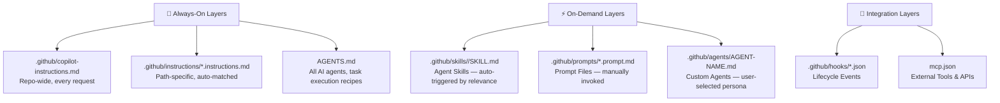

# How to Organize AI Skills: Documentation, Examples, Inline vs. Referenced, Runtime Specifics, and Distribution

**Research Date:** May 2026  
**Query Type:** Conceptual + Technical Deep-dive

---

## Executive Summary

There is a **clear, documented consensus** on how to organize AI skills, codified by both Anthropic's official Agent Skills best practices and GitHub's Copilot documentation. The governing architecture is called **progressive disclosure**: metadata loads at startup (~100 tokens), the skill body loads when triggered (<5,000 tokens), and bundled files load only as needed (no upfront cost). Skills should be **self-contained** — inline workflow instructions, a small number of calibration examples (3–5), and runtime specifics — while large reference docs, templates, and scripts live in bundled sub-files and are conditionally referenced from the skill body. For **distributable** skills (shared across teams or published publicly), self-containment is mandatory: no external URLs for critical content, no internal-only references, all assets bundled. For **internal/project-scoped** skills, lightweight pointers to living docs and project files are acceptable and reduce staleness risk.

---

## 1. The Customization Ecosystem

GitHub Copilot has a **7-tier customization ecosystem** — each layer is distinct in when it loads, who triggers it, and what it's best for.[^1]



| Layer | File | Trigger | Token Cost | Best For |
|---|---|---|---|---|
| **Custom Instructions** | `.github/copilot-instructions.md` | Automatic, every request | Always paid | Coding standards, build commands, architecture overview |
| **Path-Specific Instructions** | `.github/instructions/*.instructions.md` | Automatic (when matched files in context) | Paid when matched | Language/framework rules, scoped coding standards |
| **Agent Instructions** | `AGENTS.md` | All agentic tasks | Paid for agent tasks | Build recipes, validation steps, multi-agent workflows |
| **Agent Skills** | `.github/skills/<name>/SKILL.md` | Automatic (Copilot picks when relevant) | Paid only when triggered | Multi-step specialist workflows with bundled assets |
| **Prompt Files** | `.github/prompts/*.prompt.md` | Manual (user invokes) | Paid when invoked | Repeatable single tasks ("generate tests", "scaffold component") |
| **Custom Agents** | `.github/agents/AGENT-NAME.md` | Manual (user selects) | Paid when selected | Specialist persona with tool restrictions |
| **MCP Servers** | `mcp.json` | Automatic or named | Varies | External tools, databases, APIs |

**Choosing between skill types:** Use **Custom Instructions** for broadly applicable, always-relevant context. Use **Agent Skills** for detailed, specialized instructions that should only activate when relevant. Use **Prompt Files** for single-task templates.[^2]

---

## 2. The Core Principle: Progressive Disclosure

Everything flows from one governing concept stated explicitly in Anthropic's Agent Skills documentation[^3]:

> *"The context window is a public good. Your Skill shares the context window with everything else Claude needs to know — the system prompt, conversation history, other skills' metadata, your actual request."*

Three levels of loading exist:

| Level | What Loads | When | Token Cost |
|---|---|---|---|
| **Metadata** | `name` + `description` frontmatter | At startup for all skills | ~100 tokens/skill |
| **Instructions** | Full `SKILL.md` body | When the skill is triggered | < 5,000 tokens |
| **Resources** | Bundled `references/`, `scripts/`, `assets/` files | Only when explicitly referenced in instructions | No upfront cost |

**Practical consequence:** SKILL.md acts as a table of contents — it orchestrates which bundled resources to load and when. The Anthropic best practices guide explicitly states: *"SKILL.md serves as an overview that points Claude to detailed materials as needed, like a table of contents in an onboarding guide. Keep SKILL.md body under 500 lines for optimal performance."*[^4]

---

## 3. What Goes Inline vs. Referenced

### 3a. Always Inline in the Skill/Instructions Body

| Content Type | Why Inline | Example |
|---|---|---|
| **Core workflow steps** | Always needed when skill is active | "1. Read guard streams 2. Execute Decider 3. Append events" |
| **Decision tree / quick-reference table** | Needed on every invocation to pick approach | "Use DCB when: multi-stream consistency required" |
| **3–5 calibration examples** | Style/format depends on seeing them; described below | Input/output pairs for code structure |
| **Explicit NEVER/ALWAYS constraints** | Safety guards must be available on every request | "NEVER emit side effects from Decide()" |
| **Build/run/test commands** | Agent needs exact commands; can't be wrong | `dotnet test --no-build` |
| **Runtime compatibility** | Prevents environment failures | "Requires Python 3.8+ and git" |
| **Naming conventions** | Applied to every line of generated code | "Events: PascalCase past tense (RoomBooked)" |
| **Directory tree** | Eliminates wasted `ls`/`find` tool calls | Code block of project layout |
| **Anti-patterns** (❌/✅) | Prevents common mistakes inline | "❌ Mutable state → ✅ Use records with `with`" |
| **Tool/dependency versions** | Prevents CI failures from wrong versions | `golangci-lint v2.10.1` |
| **Common errors and fixes** | Drastically reduces agent retry loops | See `## Common Errors` in github-mcp-server[^5] |

### 3b. Externalize to Bundled Files

| Content Type | File Location | Why External |
|---|---|---|
| **Large reference documentation** | `references/REFERENCE.md` | Too large to pay on every invocation |
| **Full API documentation** | `references/API.md` | Token cost too high; only sometimes needed |
| **Output templates** | `assets/templates/*.md` | Loaded when generating that output type |
| **Database/event schemas** | `references/SCHEMA.md` | Needed for schema-aware operations only |
| **Domain-specific deep dives** | `references/FORMS.md`, etc. | Loaded only for that specific scenario |
| **Runnable scripts** | `scripts/*.py`, `scripts/*.sh` | Run as black boxes, not read eagerly |
| **Large example libraries** (10+) | `examples/*.py` | Listed in SKILL.md by filename; read on demand |
| **Time-sensitive data** (versions, dates) | Separate file + "old patterns" section | Goes stale inline; version field in metadata |
| **Advanced/rare operations** | `references/ADVANCED.md` | Don't burden common path with uncommon content |

**The 1-level rule:** All bundled files should link directly from SKILL.md — not from other bundled files. When Claude encounters nested references, it may use `head -100` to preview rather than reading complete files, getting incomplete data.[^4]

---

## 4. How to Handle Examples

Examples are the **highest-ROI investment** in prompt quality. Research from DAIR.AI shows even examples with random labels improve output quality by establishing format — the format itself is the key signal.[^6]

### 4a. Inline Examples: 3–5 is the Sweet Spot

**Use inline examples for:**
- **Style and format calibration** — when output quality depends on seeing the pattern
- **Anti-pattern demonstrations** — ❌/✅ pairs showing incorrect vs. correct behavior
- **Input/output contract** — showing the exact shape of what goes in and comes out
- **Short code blocks** (5–25 lines) that Claude should generate for users

**Template for inline examples:**
```markdown
## Examples

<example>
Input: StartGameCommand(Id, Name)
Output: [GameStarted(GameId, Name)]
State change: GameState.IsStarted → true
</example>

<example>
Input: StartGameCommand when GameState.IsStarted = true  
Output: [] (rejection — no events emitted)
</example>
```

**Anthropic's official guidance:**
> *"For Skills where output quality depends on seeing examples, provide input/output pairs just like in regular prompting. Examples help Claude understand the desired style and level of detail more clearly than descriptions alone."*[^4]

**When NOT to keep examples inline:**
- Example library > 5–10 examples → move to `examples/EXAMPLES.md`
- Examples are runnable scripts → move to `examples/*.py` or `scripts/`
- Example size would push SKILL.md past 500 lines

### 4b. External Example Files

For larger example sets:
- Index them in SKILL.md under a `## Reference Files` section by filename
- Add explicit conditional loading instructions: *"Load `examples/element_discovery.py` when the user asks about element selection patterns"*
- **Do not read scripts eagerly** — `webapp-testing` SKILL.md states explicitly: *"DO NOT read the source until you try running the script first... scripts can be very large and thus pollute your context window."*[^7]

```markdown
## Reference Files
- `examples/element_discovery.py` — Discovering buttons, links, and inputs
- `examples/static_html_automation.py` — Using file:// URLs for local HTML
- Load examples when the user needs to understand specific patterns
```

---

## 5. Runtime Specifics — Put Them Inline

Based on production skill analysis (Anthropic's `pdf`, `docx`, `webapp-testing` skills, plus `quality-playbook` and `acquire-codebase-knowledge` from awesome-copilot), **runtime specifics belong inline in the SKILL.md body**.[^7][^8]

### What counts as "runtime specifics"

| Type | Example | Where |
|---|---|---|
| **Compatibility requirements** | "Requires Python 3.8+ and git" | YAML frontmatter `compatibility:` field |
| **Platform support** | "Cross-platform" or "Windows only" | YAML frontmatter `compatibility:` field |
| **Package/library invocation** | `from playwright.sync_api import sync_playwright` | Inline code block |
| **Build/test/run commands** | `dotnet test --no-build --filter Category=Unit` | Inline as numbered ordered steps |
| **Tool versions** | `golangci-lint v2.10.1` | Inline in the relevant section |
| **Environment variables** | Table of `DAPR_HOST`, `STATE_STORE` etc. | Inline table |
| **Script invocation pattern** | `python scripts/scan.py --help` first, then invoke | Inline as Phase 1 step |
| **Mode detection** | "CLI vs. UI mode" decision table | Inline decision table |
| **Error recovery** | "If CI fails with 'missing module', run `dotnet restore`" | Inline `## Common Errors` section |
| **Pre-commit steps** | ALWAYS run `npm run build` before committing | ALWAYS directive inline |

**Key rationale:** Skills load only when relevant, so runtime specifics don't waste tokens on unrelated requests. The body must be self-contained enough for any agent to execute without exploration. The `quality-playbook` SKILL.md packs all runtime invocation commands inline precisely for this reason — the description tells Copilot *when* to trigger the skill, and the body must tell it *how*.[^8]

### YAML Frontmatter for Runtime Context

```yaml
---
name: add-command-slice
description: 'Scaffold a new command slice for dapr-lab: Command record, Decider logic, 
  ASP.NET endpoint, and Given-When-Then tests following the event sourcing Decider pattern.
  Use when asked to add a new command, feature, or slice.'
license: MIT
compatibility: '.NET 10+. Requires dotnet CLI. Project must follow dapr-lab module layout.'
metadata:
  version: "1.0"
---
```

---

## 6. The Decision Framework: What Goes Where

```
Q: Should this content go inline in SKILL.md or in a bundled/referenced file?

├── Is it needed EVERY TIME the skill runs?
│   ├── YES → Inline in SKILL.md
│   └── NO → Continue...

├── Is it a style/format example? (output calibration)
│   ├── YES (≤5 examples) → Inline in SKILL.md
│   └── YES (>5 examples) → examples/EXAMPLES.md

├── Is it a workflow, checklist, or decision tree?
│   ├── Simple (< 50 lines) → Inline in SKILL.md
│   └── Complex or multi-branch → Separate WORKFLOW.md

├── Is it reference data? (API docs, schemas, templates)
│   └── ALWAYS → references/ or assets/ — never inline

├── Is it a runnable script?
│   └── ALWAYS → scripts/ — invoke with --help first, never read eagerly

├── Is it advanced/rarely needed?
│   └── Conditional load → references/ADVANCED.md with explicit trigger

└── Would adding it push SKILL.md past 500 lines?
    └── YES → Extract to references/ and add a conditional load instruction
```

---

## 7. Distribution: How Organization Changes

The key principle: **distributable skills must be 100% self-contained**. When a user runs `gh skill install owner/repo skill-name`, the skill directory is copied to their machine. Any external reference becomes a broken link.[^9]

### Internal vs. Distributable Comparison

| Dimension | Internal/Project-Scoped | Distributable/Shared |
|---|---|---|
| **External references** | OK to reference same-repo files (`docs/style/records.md`) | ❌ Never — broken after install |
| **Internal wikis/Confluence** | OK to link | ❌ Never |
| **Private API hosts** | OK (expected) | ❌ Never — portability violation |
| **Reference docs** | Can point to living docs (fresher) | **Must bundle** in `references/` |
| **Scripts** | Can use internal CLIs | **Must bundle** self-contained scripts in `scripts/` |
| **Templates** | Can reference repo templates | **Must bundle** in `assets/templates/` |
| **Public URLs (stable specs)** | OK (e.g., PEP 263, RFC) | ✅ Acceptable but risky (URLs rot) |
| **Org-specific conventions** | Fine — expected | Strip out or generalize |
| **License field** | Optional | **Required** for public distribution |

### Versioning for Distribution

The `gh skill` CLI (v2.90.0+) provides full versioning:[^9]

```bash
# Install latest
gh skill install github/awesome-copilot acquire-codebase-knowledge

# Pin to a specific version
gh skill install github/awesome-copilot acquire-codebase-knowledge --pin v1.3.0

# Check for updates (pinned skills are skipped)
gh skill update

# Validate before publishing
gh skill publish --dry-run
```

Provenance metadata (source repo, ref, tree SHA) is written into the installed SKILL.md at install time, enabling `gh skill update` to detect upstream changes.

**Version tracking convention:**
```yaml
metadata:
  version: "1.3"  # Semantic version; update with each significant change
```

### The Self-Containment Test

Before distributing, verify every reference in SKILL.md:
1. All file references use relative paths (e.g., `./references/API.md`, not `/project/docs/API.md`)
2. All scripts are bundled in `scripts/` and have no hardcoded internal dependencies
3. No hostnames, URLs, or API endpoints that are private
4. All templates are in `assets/`
5. Run `gh skill preview owner/repo skill-name` — consumers can audit the full bundled content

---

## 8. The Recommended SKILL.md Structure

```markdown
---
name: my-skill                                # Required. Must match directory name.
description: 'What it does AND when to use it. Written for strangers, not insiders.
  Triggers: "add a command slice", "scaffold a new feature"...'
license: MIT                                  # Required for distribution
compatibility: '.NET 10+. Requires dotnet CLI.'  # Required for runtime-specific skills
metadata:
  version: "1.0"
---

# Skill Name

## Overview
1-3 sentence purpose. Assume Claude already knows domain basics.

## When to Use This Skill
- Trigger conditions (what the user says)
- When NOT to trigger (avoid over-activation)

## Workflow
1. Step one (imperative, numbered, ordered)
2. Step two
3. Step three

## Decision Guide
- Use approach A when: [condition]
- Use approach B when: [condition]

## [Small] Examples
<example>
Input: [brief example]
Output: [brief expected output]
</example>

## Anti-Patterns
| ❌ Don't | ✅ Do Instead |
|---|---|
| [bad pattern] | [correct pattern] |

## Reference Files (Load Conditionally)
- `references/DEEP-DIVE.md` — Load for advanced [X] operations
- `references/SCHEMA.md` — Load when working with event schemas
- `scripts/scan.py` — Run with `--help` first, invoke from project root
- `assets/templates/` — Copy to target directory when scaffolding
```

---

## 9. Applying This to Project-Level Skills (Like `add-command-slice`)

For project-specific skills (internal, not distributed), the guidance relaxes slightly:

**OK to include in skill body:**
- References to `docs/style/records.md`, `docs/style/decider.md`, etc. (same-repo docs)
- Project-specific stream naming conventions
- Module layout pointers (`See src/SampleApp/Modules/Sample/ for reference`)

**Still recommended inline:**
- ONE canonical example (e.g., StartGame slice — all 6 files)
- Decision rules ("generate ID server-side for POST, accept from route for PUT")
- Anti-patterns specific to the project
- Compatibility (`.NET 10+, dotnet CLI`)

**The minimum effective skill pattern for internal project use:**

```markdown
---
name: add-command-slice
description: 'Scaffold a new command slice: Command record, Decider logic, 
  ASP.NET Feature endpoint, and Given-When-Then tests following the Decider pattern.
  Use when asked to add a new command, feature, or slice to the project.'
license: MIT
compatibility: '.NET 10+. Requires dotnet CLI. Project follows dapr-lab module layout.'
metadata:
  version: "1.0"
---

## Canonical Example: StartGame Slice

### State Record
```csharp
public record GameState(Guid GameId = default, string Name = "", bool IsStarted = false)
    : State(GameId);
```

### Command Record
```csharp
public record StartGameCommand(Guid Id, [Required][StringLength(100)] string Name)
    : GameCommand(Id);
public abstract record GameCommand(Guid Id) : Command(Id);
```

### Event Record
```csharp
public record GameStarted(Guid GameId, string Name) : GameEvent(GameId);
public abstract record GameEvent(Guid Id) : DomainEvent(Id);
```

### Decider
[...full StartGame Decider inline...]

### Feature
[...full StartGameFeature inline...]

### Test Template
[...Given-When-Then test inline...]

## Generation Instructions
Generate similar code for [user request], following the StartGame structure above.

## See Also (Project Guidelines)
- `docs/style/records.md` — Record naming conventions, validation patterns, gotchas
- `docs/style/decider.md` — Decision logic, guard streams, event routing
- `docs/style/endpoints.md` — Endpoint mapping, error handling, response patterns

## Anti-Patterns
| ❌ Don't | ✅ Do Instead |
|---|---|
| Mutable state (`{ set; }`) | Immutable records with `with` expressions |
| Side effects in Decide | Pure function only; return events, no I/O |
| Non-idempotent Evolve | Event should carry `NewState`, not `Delta` |
| Imperative event names (`BookRoom`) | Past-tense event names (`RoomBooked`) |
```

---

## 10. Differences from Instructions Files vs. Skills

Real-world examples from major OSS projects (VS Code, github-mcp-server, dapr) demonstrate the inline-heavy pattern for `copilot-instructions.md`:[^5][^10][^11]

**`copilot-instructions.md` (always-on, repo-wide) — production structure:**
```markdown
## Project Overview    ← architecture summary
## Repository Layout   ← directory tree as code block (universal — eliminates ls/find calls)
## Build/Test/Lint     ← ALWAYS run these commands in this exact order
## Coding Conventions  ← naming, style, patterns to avoid
## Common Errors       ← FAQ for agent failures (reduces retry loops)
## Important Reminders ← numbered "never do X" list
```

**Key production patterns (from vscode, github-mcp-server, dapr):**
- `MANDATORY:` and `NEVER`/`ALWAYS` directives in bold — imperative language for critical constraints
- Inline bash code blocks for every command the agent might run
- `## Learnings` section for patterns captured from agent sessions (VS Code's innovation)
- `## Common Errors & Solutions` — FAQ for agent failures
- Tables for environment variables and file inventories
- PR checklists as `- [ ]` markdown checkboxes
- Exact version numbers inline for build tools (e.g., `golangci-lint v2.10.1`)

**What the best production files do NOT do:**
- Duplicate content from `CONTRIBUTING.md` — they link it once
- Include external spec documents inline — they reference by URL or path
- Include full API references — too large, linked instead
- Include architecture diagrams as text — reference the diagram file

---

## 11. Confidence Assessment

| Finding | Confidence | Source Quality |
|---|---|---|
| 7-tier ecosystem and progressive disclosure | ✅ High | Official GitHub and VS Code docs |
| 3–5 examples inline sweet spot | ✅ High | Anthropic official docs + DAIR.AI research |
| Keep SKILL.md under 500 lines | ✅ High | Anthropic Agent Skills best practices |
| Distributable skills must be self-contained | ✅ High | GitHub docs + Agent Skills spec |
| Runtime specifics inline in SKILL.md | ✅ High | Confirmed by 5+ production skill examples |
| 4,000 char limit for code review reads | ✅ High | Official GitHub docs on code review |
| No system messages in VS Code LM API | ✅ High | Official VS Code API docs |
| Organization-level skills "coming soon" | ✅ High | Official GitHub docs (stated explicitly) |
| `agentskills.io` spec details | ⚠️ Medium | Fetched indirectly via subagent; spec domain availability uncertain |
| Best "inline example count" for project-level skills | ⚠️ Medium | Extrapolated from Anthropic's 3–5 recommendation + community patterns |
| VS Code `context: fork` for skills | ⚠️ Low | Mentioned as "experimental" in VS Code docs |

---

## Key Repositories & Resources

| Resource | URL |
|---|---|
| Official Customization Cheat Sheet | https://docs.github.com/en/copilot/reference/customization-cheat-sheet |
| GitHub Agent Skills How-To | https://docs.github.com/en/copilot/how-tos/use-copilot-agents/cloud-agent/add-skills |
| About Agent Skills | https://docs.github.com/en/copilot/concepts/agents/about-agent-skills |
| Custom Instructions Guide | https://docs.github.com/en/copilot/customizing-copilot/adding-repository-custom-instructions-for-github-copilot |
| VS Code Prompt Files | https://code.visualstudio.com/docs/copilot/customization/prompt-files |
| VS Code Agent Skills | https://code.visualstudio.com/docs/copilot/customization/agent-skills |
| Anthropic Prompt Best Practices | https://docs.anthropic.com/en/docs/build-with-claude/prompt-engineering/claude-prompting-best-practices |
| Anthropic Agent Skills Best Practices | https://docs.anthropic.com/en/docs/agents-and-tools/agent-skills/best-practices |
| Community Skills Collection | https://github.com/github/awesome-copilot |
| Skills Marketplace | https://awesome-copilot.github.com/skills/ |
| Reference Implementation Skills | https://github.com/anthropics/skills |

---

## Footnotes

[^1]: [GitHub Copilot Customization Cheat Sheet](https://docs.github.com/en/copilot/reference/customization-cheat-sheet) — Official 7-tier taxonomy of customization layers

[^2]: [GitHub — About Agent Skills](https://docs.github.com/en/copilot/concepts/agents/about-agent-skills) — "Use custom instructions for simple instructions relevant to almost every task... and skills for more detailed instructions that Copilot should only access when relevant."

[^3]: [Anthropic — Agent Skills Overview](https://docs.anthropic.com/en/docs/agents-and-tools/agent-skills/overview) — Three levels of loading: metadata always (~100 tokens/skill), instructions on trigger (<5,000 tokens), resources on demand

[^4]: [Anthropic — Agent Skills Best Practices](https://docs.anthropic.com/en/docs/agents-and-tools/agent-skills/best-practices) — Progressive disclosure patterns, 500-line limit, context window as a public good, examples pattern, 1-level nesting rule

[^5]: `github/github-mcp-server:.github/copilot-instructions.md` (SHA `e0d6873d`) — Production example with "ALWAYS run these commands" pattern, Common Errors section, exact version numbers inline

[^6]: [DAIR.AI — Few-Shot Prompting Guide](https://www.promptingguide.ai/techniques/fewshot) — Examples improve output quality even with random labels; format is the key signal (Min et al., 2022)

[^7]: `anthropics/skills:skills/webapp-testing/SKILL.md` ([GitHub](https://github.com/anthropics/skills/blob/f458cee31a7577a47ba0c9a101976fa599385174/skills/webapp-testing/SKILL.md)) — "DO NOT read the source until you try running the script first... scripts pollute your context window"; example file indexing pattern

[^8]: `github/awesome-copilot:skills/quality-playbook/SKILL.md` — All runtime invocation commands inline; mode detection logic inline; CLI flags table inline — complete self-contained skill

[^9]: [GitHub — Add Skills — Managing with GitHub CLI](https://docs.github.com/en/copilot/how-tos/use-copilot-agents/cloud-agent/add-skills#managing-skills-with-github-cli) — `gh skill install`, version pinning, provenance metadata written at install time, `gh skill update`

[^10]: `microsoft/vscode:.github/copilot-instructions.md` (SHA `34e81e2c`) — ~400 lines; `## Learnings` section for captured patterns; inline TypeScript code blocks; MANDATORY directives

[^11]: `dapr/dapr:.github/copilot-instructions.md` (SHA `64e12fdd`) — Exact tool versions inline; license header as copy-paste code block; PR checklist as `- [ ]` items

[^12]: [GitHub — Response Customization Concepts](https://docs.github.com/en/copilot/concepts/prompting/response-customization) — Copilot code review reads only first 4,000 chars of instruction files; "do not request to refer to external resources when formulating a response"

[^13]: `github/awesome-copilot:skills/acquire-codebase-knowledge/SKILL.md` ([GitHub](https://github.com/github/awesome-copilot/blob/e07740bdd8e878cde35e3ee23eb2c1ab7afee864/skills/acquire-codebase-knowledge/SKILL.md)) — Textbook progressive disclosure: orchestration logic inline, all heavy content in `references/`, `assets/`, `scripts/`

[^14]: `anthropics/skills:skills/pdf/SKILL.md` ([GitHub](https://github.com/anthropics/skills/tree/main/skills/pdf)) — Production pattern: 80% of common cases inline; advanced content in `reference.md` (16.7KB) and `forms.md` (11.9KB)

[^15]: [VS Code — Chat Participant Tutorial](https://code.visualstudio.com/api/extension-guides/chat-tutorial) — System prompts defined as inline TypeScript string constants; no built-in mechanism for loading from external `.md` files at the Chat API level

[^16]: [Anthropic — Claude Prompting Best Practices](https://docs.anthropic.com/en/docs/build-with-claude/prompt-engineering/claude-prompting-best-practices) — "Think of Claude as a brilliant but new employee who lacks context on your norms and workflows"; XML tags for structural clarity; positive examples > negative rules

[^17]: [Agent Skills Specification](https://agentskills.io/specification) — Open standard maintained by `agentskills/agentskills`; `SKILL.md` frontmatter schema: `name` (required, ≤64 chars), `description` (required, max 1024 chars), `license`, `compatibility`, `metadata`

[^18]: [GitHub — About Building Copilot Extensions](https://docs.github.com/en/copilot/building-copilot-extensions/about-building-copilot-extensions) — Distribution via Plugins (`plugin.json`) bundles skills + agents + commands as an installable package; organization-level skills "coming soon"

[^19]: `github/awesome-copilot:skills/add-educational-comments/SKILL.md` — Contrast example: fully inline because task is simple and examples are critical for style calibration; uses external URL references (PEP 263) for authoritative public specs

[^20]: [Brex Prompt Engineering Guide](https://github.com/brexhq/prompt-engineering) (SHA `a43ad6d`) — Production prompt design: truncate from messages array (not system prompt); append-only mental model; token budgeting for input + output

